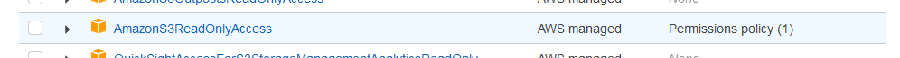

### Starting S3BE by docker


#### Already configured S3 backend with minio
You need at least:
* S3 backend provided by minio (https://docs.min.io/docs/minio-quickstart-guide.html)
* ACCESS and SECRET key's (considered sometimes as username/password) to access your bucket.
* It is recommended to expose only specific buckets. In this example bucket `downloads` and `sheets` will be exposed.

```
docker run -d -n s3be
  -e S3_PROVIDER="minio"
  -e S3_ACCESS_KEY="Put ACCESS_KEY_HERE"
  -e S3_SECRET_KEY="Put SECRET_KEY_HERE"
  -e MINIO_ENDPOINT="Put HTTP or HTTPS address to your minio server (by default it is 9000 port)."
  -e EXPOSER_ALLOWED_BUCKETS="Put here names of buckets you want to expose separated by semicoln"
  mzylowski/s3-bucket-exposer:1.0
```
So for example:
```
docker run -d --name=s3be \
  -e S3_PROVIDER="minio" \
  -e S3_ACCESS_KEY="admin" \
  -e S3_SECRET_KEY="password" \
  -e MINIO_ENDPOINT="https://some.domain:9000" \
  -e EXPOSER_ALLOWED_BUCKETS="downloads,sheets" \
  mzylowski/s3-bucket-exposer:1.0
```

#### Configuring S3 bucket on AWS and running S3BE with it
Let's create a bucket:
1. Log into AWS console
2. Navigate to S3 service and click 'Create Bucket'
3. Specify bucket name and region
4. Choose ownership (ACLs disable is recommended)
5. Ensure 'Block all public access' is checked.
6. Set rest of the options for Your needs and click 'Create Bucket'

Now it is time to create user to have access to our S3 bucket:
1. Navigate to IAM service (https://console.aws.amazon.com/iam/home)
2. Go to `users` in `access managment` and create a new user
3. Specify username and set access credentials type to "Access key - Programmatic access"
4. On next page (set permissions) you can click to "Attach existing policies directly" and choose "AmazonS3ReadOnlyAccess":

5. Click next to 'tags' and next to 'review'
6. After user creation You will see ACCESS and SECRET keys needed by S3BE to connect.

Let's start S3BE:
```
docker run -d --name=s3be \
  -e S3_PROVIDER="aws" \
  -e S3_ACCESS_KEY="admin" \
  -e S3_SECRET_KEY="password" \
  -e EXPOSER_ALLOWED_BUCKETS="downloads,sheets" \
  mzylowski/s3-bucket-exposer:1.0
```
